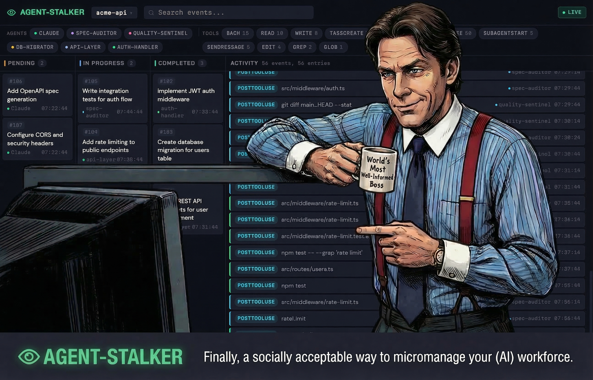
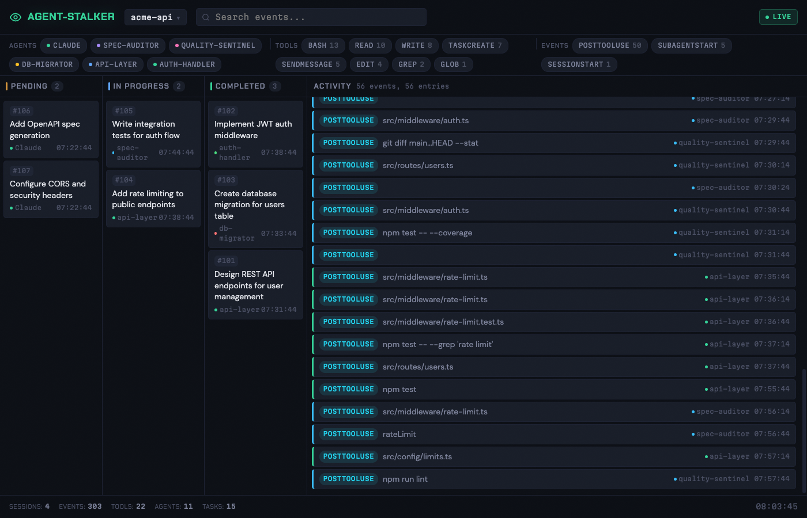
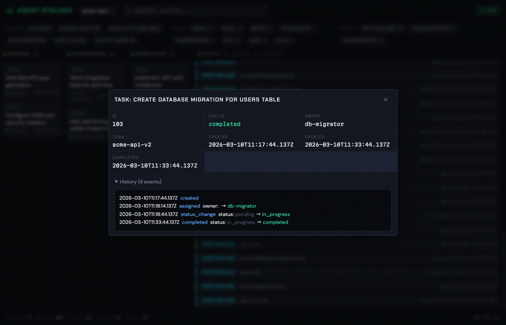
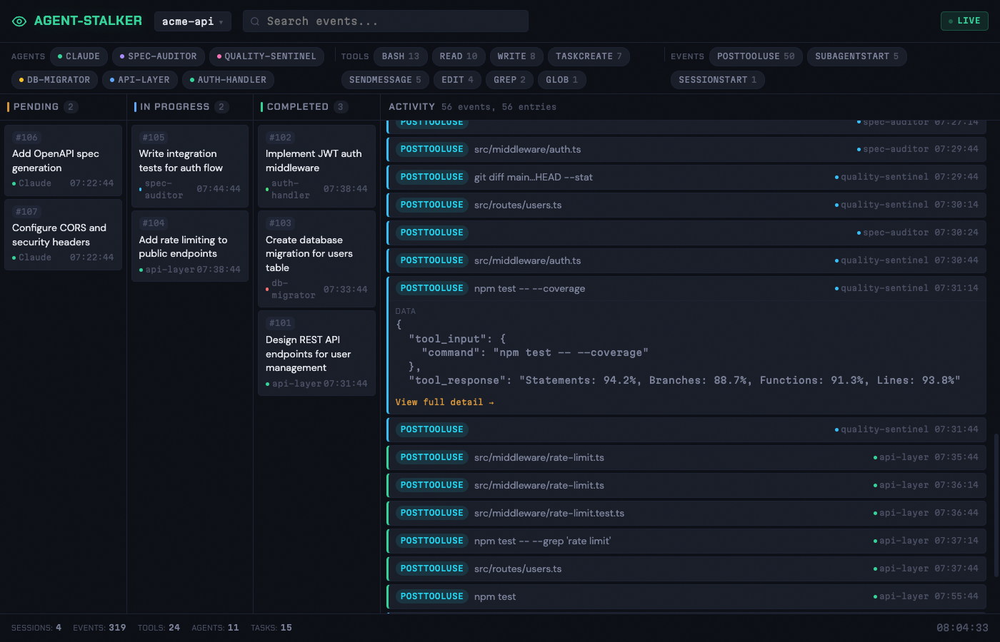

# Agent Stalker

Real-time observability for Claude Code agent teams. Track sessions, tool use, task lifecycle, and inter-agent messaging through a live web dashboard and CLI query engine.

## What It Does

Agent Stalker is a **purely observational** Claude Code plugin. It hooks into Claude's event system to record what agents do — without ever modifying or injecting into agent communication. Everything you see in the dashboard is a passive reflection of actual agent activity.

**Track everything your agents do:**
- **Sessions** — active, ended, and archived sessions with working directory context
- **Tool use** — every Read, Write, Bash, Edit, Grep, and custom tool call with inputs/outputs
- **Agent teams** — subagent spawns, stops, and per-agent activity timelines
- **Task lifecycle** — tasks flow through Pending → In Progress → Completed in a kanban board
- **Inter-agent messaging** — SendMessage calls between teammates

## Screenshots

### Live Dashboard
Full dashboard with kanban task board, agent/tool/event filter chips, and real-time activity feed. Each agent is color-coded for easy visual tracking.



### Task Detail
Click any task card to see metadata, ownership, team assignment, and full event history showing every state transition.



### Event Detail
Expand any activity event to see the raw tool input/output JSON data with syntax highlighting.



## Installation

### From the Hartye Plugins Marketplace (recommended)

Add the marketplace to your Claude Code settings, then install the plugin:

```bash
# Add the marketplace (one-time setup)
claude plugins add-marketplace ehartye/hartye-claude-plugins

# Install agent-stalker
claude plugins install agent-stalker
```

To update to the latest version:

```bash
claude plugins update
```

### From Source (local development)

Clone the repo and register it as a local marketplace:

```bash
git clone https://github.com/ehartye/agent-stalker.git
cd agent-stalker
bun install
```

Add to your Claude Code settings (`~/.claude/settings.json`):

```json
{
  "extraKnownMarketplaces": [
    {
      "name": "agent-stalker-dev",
      "source": "directory",
      "path": "/path/to/agent-stalker"
    }
  ]
}
```

Then install:

```bash
claude plugins install agent-stalker --marketplace agent-stalker-dev
```

## Usage

### Start the Dashboard

```
/stalker-ui
```

Opens the web dashboard at `http://localhost:3141`. Use `--port <number>` to change the port.

```
/stalker-ui stop
```

Stops the running dashboard server.

### Query from the CLI

```
/stalker sessions              # List recent sessions
/stalker tools --session <id>  # Tool use frequency
/stalker events --since 1h     # Recent events
/stalker tasks --status pending # Filter tasks by status
/stalker agents                # List all spawned agents
/stalker stats                 # Summary statistics
```

### Configure Content Capture

```
/stalker-config             # Show current config
/stalker-config set Bash full       # Capture full Bash output
/stalker-config set Read metadata   # Metadata only for Read
/stalker-config reset               # Restore defaults
```

Default capture rules:
| Tool | Rule |
|------|------|
| Edit, Write | full |
| Read, Glob, Grep | metadata |
| Bash | maxLength 2000 |
| Everything else | maxLength 500 |

## Dashboard Features

- **Session selector** — pick one or more sessions to view simultaneously; search by name
- **Kanban board** — tasks organized by status (Pending / In Progress / Completed) with owner badges
- **Filter chips** — filter by agent, tool name, or event type; click to toggle, counts update live
- **Activity feed** — chronological event stream with color-coded agent labels; click to expand JSON detail
- **Task modals** — click any task card for full metadata and event history
- **Live mode** — auto-polls for new events; handles browser tab throttling with visibility-change detection
- **Search** — filter events by text across tool names, file paths, and commands
- **Stats footer** — session count, total events, unique tools, agents, and tasks at a glance

## Architecture

```
hooks/tracker.ts          # Hook entrypoint — receives events via stdin
lib/ingest.ts             # Parses hook payloads, writes to SQLite
lib/db.ts                 # Database schema + migrations (v1-v5)
lib/query.ts              # CLI query engine
lib/config.ts             # Content capture configuration
lib/truncate.ts           # Content truncation per capture rules
lib/resolve-team.ts       # Team/agent resolution logic
ui/server.ts              # Bun HTTP server — REST API + static files
ui/app.js                 # Single-file dashboard UI (vanilla JS)
ui/index.html             # Dashboard HTML shell
ui/style.css              # Dark theme styles
commands/                 # Slash command definitions
.claude-plugin/plugin.json # Plugin manifest
hooks/hooks.json          # Hook event registrations
```

All hooks run **asynchronously** via `bun` and write to a shared SQLite database at `~/.claude/agent-stalker.db` (WAL mode for concurrent access). The web UI reads from the same database via a lightweight REST API.

### Tracked Hook Events

| Event | What's Captured |
|-------|----------------|
| `SessionStart` / `SessionEnd` | Session lifecycle, CWD, model, permissions |
| `PreToolUse` / `PostToolUse` | Tool name, inputs, outputs (per capture rules) |
| `SubagentStart` / `SubagentStop` | Agent spawn/stop with type and transcript path |
| `TaskCompleted` | Task completion with subject and owner |
| `TeammateIdle` | Idle agent detection |
| `UserPromptSubmit` | User prompt submissions |
| `Stop` | Session stop events |

## Requirements

- [Bun](https://bun.sh) runtime (used by hooks and the dashboard server)
- Claude Code with plugin support

## License

MIT
